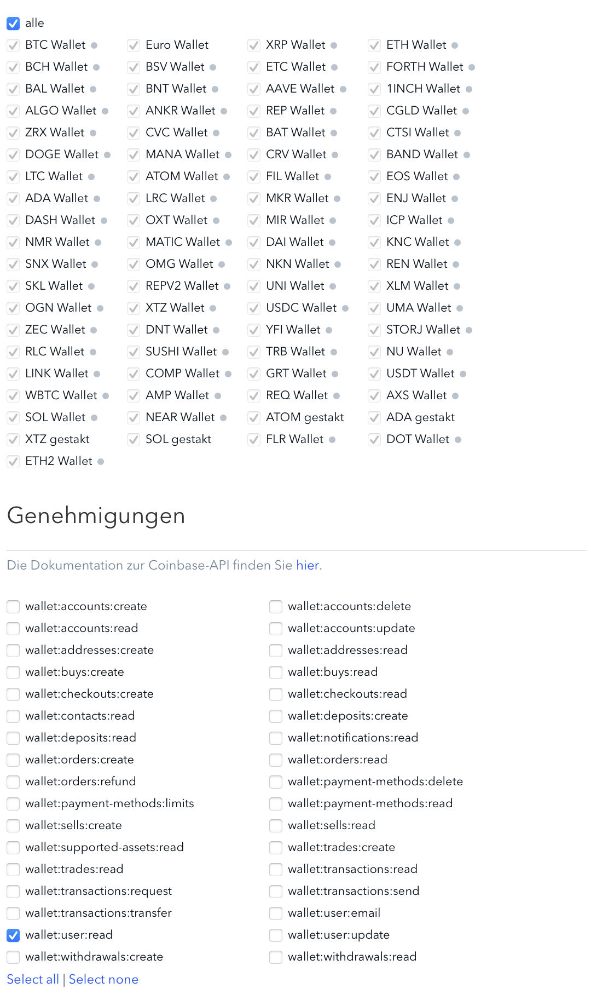

# catws - Coinbase Advanced Trade WebSocket

The aim of this project is to provide an easy accessible api in go
for connecting an consuming the *Coinbase Advanced Trade WebSocket*

See [Advanced Trade WebSocket Overview](https://docs.cloud.coinbase.com/advanced-trade-api/docs/ws-overview) for more
details.

## Installation

`go get -u github.com/sknr/catws`

## Preparation

In order to use the Coinbase Advanced Trade WebSocket you need to create an API key.

1. Login to your Coinbase account at https://www.coinbase.com
2. Go to **settings** page and select the **API** tab (https://www.coinbase.com/settings/api)
3. Create a new API key for all crypto pairs and with permission set to at least `wallet:user:read`


## Usage

```go
package main

import (
	"fmt"
	"github.com/sknr/catws"
	"os"
	"os/signal"
	"time"
)

func main() {
	c := make(chan os.Signal, 1)
	signal.Notify(c, os.Interrupt)

	ws := catws.New(
		catws.WithCredentials("YOUR_COINBASE_API_KEY", "YOUR_COINBASE_API_SECRET"),
		catws.WithLogging(), // Enable logging
	)
	// Subscribe to user channel for all product ids
	ws.Subscribe(catws.UserChannel, nil)
	ws.Subscribe(catws.TickerBatchChannel, []string{"BTC-EUR", "ETH-EUR", "XRP-EUR"})
	quitChan := make(chan struct{})

	go func() {
		for {
			select {
			//case m := <-ws.Channel.Heartbeat:
			//	fmt.Println(m)
			case m := <-ws.Channel.Subscription:
				fmt.Println(m)
			case m := <-ws.Channel.User:
				fmt.Println(m)
			case m := <-ws.Channel.Ticker:
				fmt.Println(m)
			case m := <-ws.Channel.Status:
				fmt.Println(m)
			case <-quitChan:
				fmt.Println("shutdown go-routine...")
				return
			}
		}
	}()

	// Block until a signal is received.
	<-c
	// Correctly unsubscribe from user channel since only one connection per user is allowed
	ws.Unsubscribe(catws.UserChannel, nil)
	time.Sleep(time.Second)
	quitChan <- struct{}{}
	<-quitChan
	fmt.Println("closing websocket...")
	ws.CloseNormal()
}

```